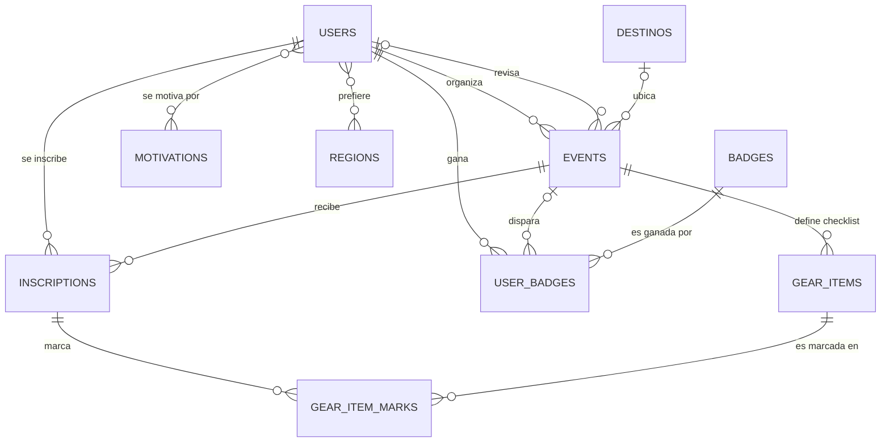
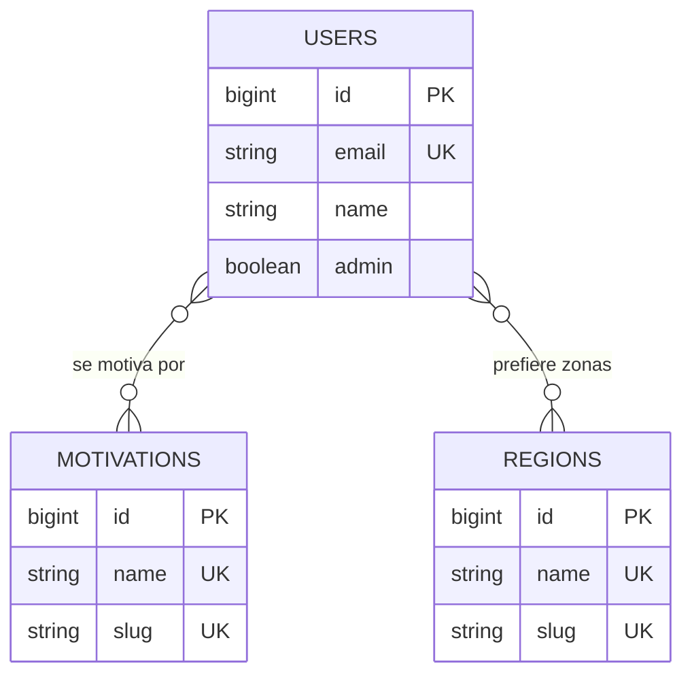
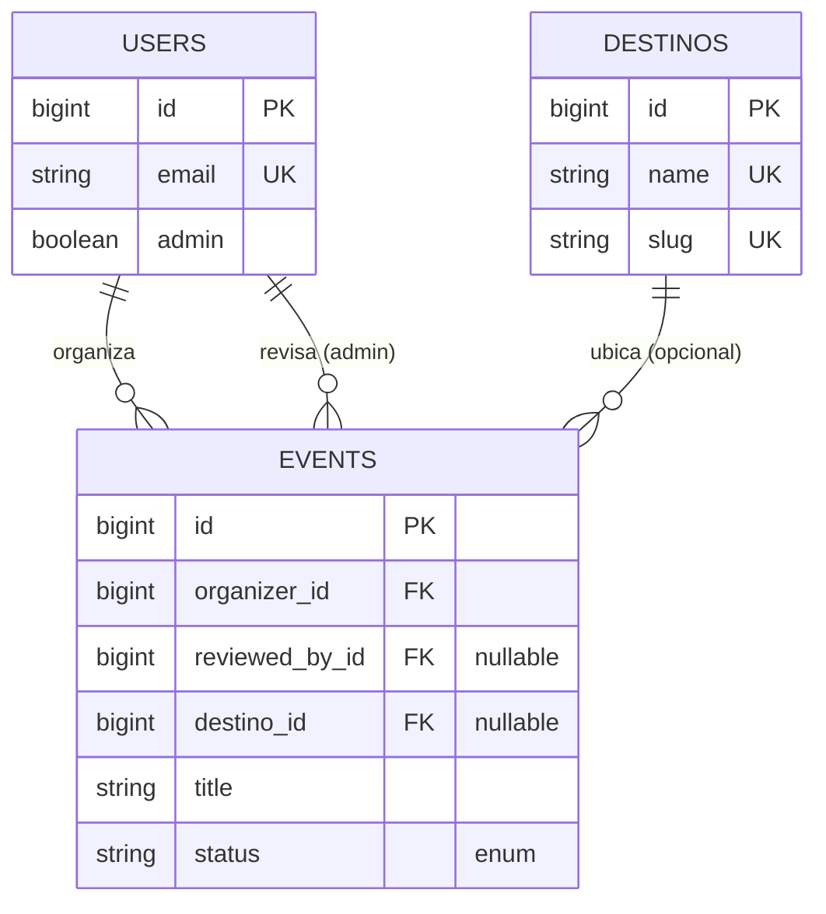
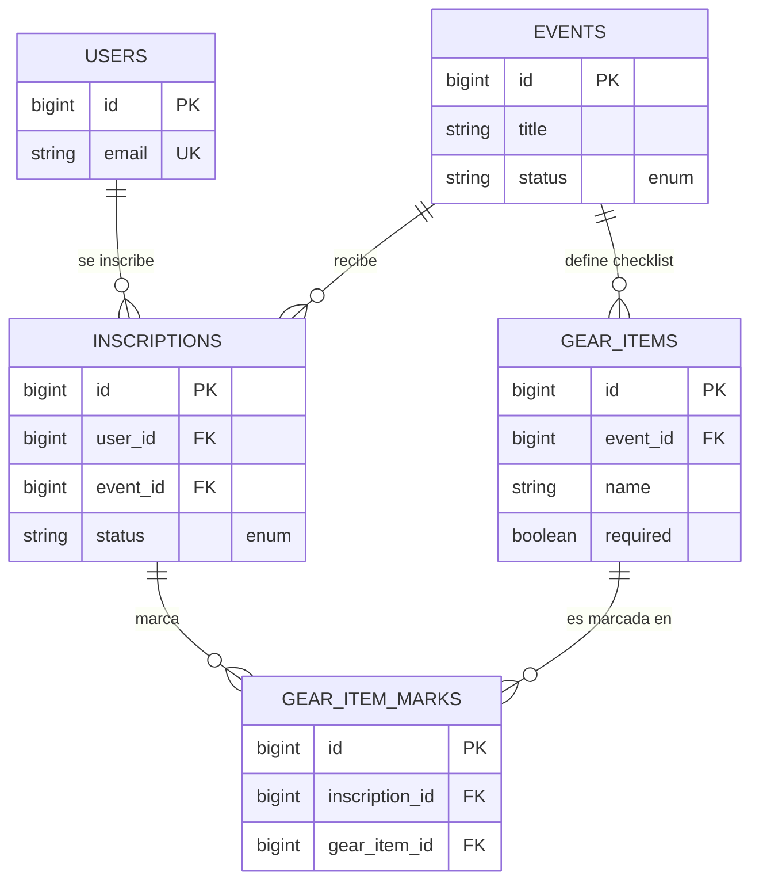
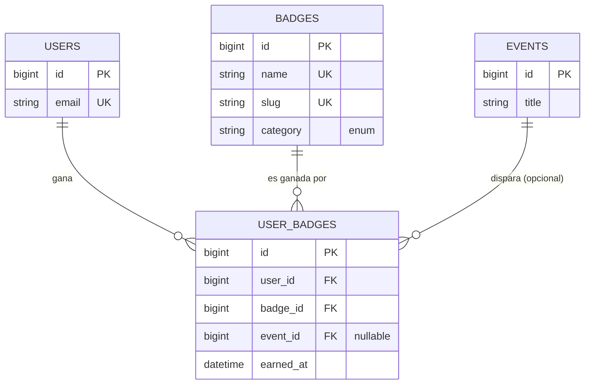

# Relaciones entre entidades

Paso 3 del modelo de datos. Diagramas ER por dominio + asociaciones
ActiveRecord.

> Pasos 1, 2, 4 y 5 en [`data-model.md`](./data-model.md).

---

## Dominios

Las 12 tablas se organizan en 4 dominios. Cada dominio agrupa
entidades que comparten propósito de negocio.

| # | Dominio | Entidades | Función |
|---|---|---|---|
| 1 | **User** | `users`, `motivations`, `regions`, 2 join tables HABTM | Identidad + preferencias |
| 2 | **Event** | `users` (organizer), `events`, `destinos` | Oferta de caminatas |
| 3 | **Engagement** | `users`, `events`, `inscriptions`, `gear_items`, `gear_item_marks` | Inscripción + checklist |
| 4 | **Achievement** | `users`, `events`, `badges`, `user_badges` | Insignias ganadas |

`users` aparece en los 4 dominios por ser entidad central del sistema.

---

## Vista global

Las 10 tablas con modelo Ruby conectadas como mapa. Las 2 join
tables HABTM (`motivations_users`, `regions_users`) se muestran como
relaciones M-N (`}o--o{`); su tabla intermedia no se dibuja por ser
detalle de implementación.



Notación: `||` = exactamente uno, `|o` = cero o uno, `o{` = cero o
muchos, `}o--o{` = muchos a muchos.

---

## Dominio 1 — User



Join tables (`motivations_users`, `regions_users`) omitidas del
diagrama: son detalle de implementación de las M-N.

```ruby
class User < ApplicationRecord
  has_and_belongs_to_many :motivations
  has_and_belongs_to_many :regions
end

class Motivation < ApplicationRecord
  has_and_belongs_to_many :users
end

class Region < ApplicationRecord
  has_and_belongs_to_many :users
end
```

- `dependent:` — no se declara; default HABTM (borra filas de la
  join table, no toca los catálogos) es lo correcto.
- `inverse_of:` — no aplica.

---

## Dominio 2 — Event



```ruby
class User < ApplicationRecord
  has_many :organized_events, class_name: "Event",
                              foreign_key: :organizer_id,
                              dependent: :destroy,
                              inverse_of: :organizer
  has_many :reviewed_events, class_name: "Event",
                             foreign_key: :reviewed_by_id,
                             dependent: :nullify,
                             inverse_of: :reviewed_by
end

class Event < ApplicationRecord
  belongs_to :organizer, class_name: "User", inverse_of: :organized_events
  belongs_to :reviewed_by, class_name: "User", optional: true,
                           inverse_of: :reviewed_events
  belongs_to :destino, optional: true
end

class Destino < ApplicationRecord
  has_many :events
end
```

- `dependent:`: `organized_events` → `:destroy`; `reviewed_events` →
  `:nullify` (ADR-005); `Destino → events` sin `dependent:` (los
  destinos usan soft-disable).
- `inverse_of:` declarado en ambas asociaciones con FK custom
  (`organizer_id`, `reviewed_by_id`).
- `optional: true` en `reviewed_by` y `destino` (FKs nullables).

## Dominio 3 — Engagement



```ruby
class User < ApplicationRecord
  has_many :inscriptions, dependent: :destroy
  has_many :inscribed_events, through: :inscriptions, source: :event
end

class Event < ApplicationRecord
  has_many :inscriptions, dependent: :destroy
  has_many :hikers, through: :inscriptions, source: :user
  has_many :gear_items, dependent: :destroy
end

class Inscription < ApplicationRecord
  belongs_to :user
  belongs_to :event
  has_many :gear_item_marks, dependent: :destroy
  has_many :gear_items, through: :gear_item_marks
end

class GearItem < ApplicationRecord
  belongs_to :event
  has_many :gear_item_marks, dependent: :destroy
  has_many :inscriptions, through: :gear_item_marks
end

class GearItemMark < ApplicationRecord
  belongs_to :inscription
  belongs_to :gear_item
end
```

- `dependent: :destroy` en todas las cascadas: borrar Event borra
  sus inscriptions, gear_items y marks; borrar User borra sus
  inscriptions; borrar Inscription/GearItem borra sus marks.
- `source:` en los `:through` aliasados (`inscribed_events`,
  `hikers`) porque el nombre del association difiere del FK.
- `inverse_of:` no requerido: todas las FKs siguen convención.

---

## Dominio 4 — Achievement



```ruby
class User < ApplicationRecord
  has_many :user_badges, dependent: :destroy
  has_many :badges, through: :user_badges
end

class Badge < ApplicationRecord
  has_many :user_badges, dependent: :destroy
  has_many :users, through: :user_badges
end

class Event < ApplicationRecord
  has_many :user_badges, dependent: :nullify
end

class UserBadge < ApplicationRecord
  belongs_to :user
  belongs_to :badge
  belongs_to :event, optional: true
end
```

- `dependent:`: User/Badge → `:destroy`; Event → `:nullify` (preserva
  la insignia si el evento se borra, alineado con la decisión del
  Paso 2 de no perder reconocimientos históricos).
- `optional: true` en `event` por ser FK nullable.
- `inverse_of:` no requerido: todas las FKs siguen convención.
